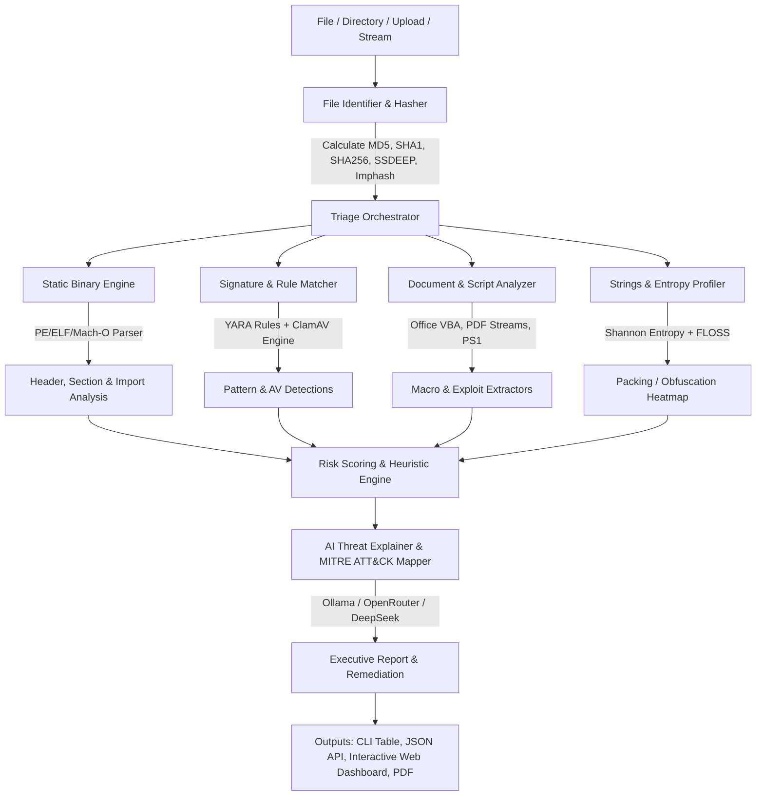

# MalGuard AI — Roadmap

> **AI-Powered Automated Malware Analysis & Threat Hunting Platform | Free & Open Source | Zero Budget Build**

---

## Executive Summary

MalGuard AI is a **free, open-source, automated multi-engine malware scanner and static/dynamic triage platform**. It combines deep static binary analysis, signature and rule-based heuristics (YARA, ClamAV, Capa), script and document de-obfuscation (Office macros, PDFs, PowerShell), entropy visualization, and Local/Cloud LLM reasoning to detect, classify, and explain malicious software in real time without recurring subscription costs.

**The Problem:** Commercial sandboxes and malware analysis platforms (VirusTotal Enterprise, Joe Sandbox, Any.Run, Hybrid Analysis Enterprise) cost anywhere from $500 to $10,000+/month with strict API quotas and data privacy constraints. Existing free command-line tools are fragmented: analysts have to manually run `pefile`, `yara`, `clamscan`, `pdfid`, and `olevba` separately, correlate outputs manually, and write triage reports by hand.

**The Solution:** MalGuard AI unifies these best-in-class FOSS tools into a single lightning-fast pipeline:
1. **Multi-Format Ingestion Engine:** Fast MIME/magic detection, archive extraction, recursive unpacking.
2. **Comprehensive Static Analysis Pipeline:** PE/ELF/Mach-O header analysis, Shannon entropy mapping, import hashing (Imphash), suspicious API call categorization (injection, evasion, persistence, exfiltration).
3. **Multi-Engine Rule Scanning:** Native YARA rule matching, ClamAV daemon integration, Capa capability mapping.
4. **Document & Script De-obfuscator:** Office VBA macro extractor, PDF stream analyzer, PowerShell/VBS/JavaScript de-obfuscator.
5. **AI Threat Intelligence & Explainer:** Local Ollama (`qwen3-coder`, `llama-3.2`) or free cloud LLMs (DeepSeek, OpenRouter) that translate raw binary disassembly, high-entropy sections, and suspicious API imports into human-readable threat assessments, MITRE ATT&CK technique mappings, and automated incident response steps.
6. **Unified Interface:** Rich terminal CLI, async REST API for CI/CD pipeline integration, and a modern Web UI with entropy heatmaps, hex viewer, and downloadable PDF/JSON reports.

---

## FOSS Tools Integration Matrix

| Tool / Library | Role / Capability | Integration Type | Why Chosen |
|---|---|---|---|
| **YARA** (`yara-python`) | Signature & pattern matching | Direct Python C-binding | Industry standard for malware classification rules |
| **ClamAV** (`clamd` / `pyClamd`) | Antivirus signature database | Daemon socket / CLI fallback | 100% open-source AV with daily signature updates |
| **pefile** / **LIEF** | PE / ELF / Mach-O binary parsing | Native Python module | Deep inspection of headers, sections, exports, imports, authenticodes |
| **Capa** (Mandiant) | Executable capability detection | Python library / CLI wrapper | Automatically maps binary code to ATT&CK tactics |
| **FLOSS** (Mandiant) | Obfuscated string extraction | CLI tool integration | Unpacks tight, stack, and encrypted strings |
| **Oletools** (`oletools`) | Office document & macro analysis | Python package | Scans Word/Excel/RTF for VBA auto-exec macros & DDE |
| **PDFiD / pdf-parser** | PDF threat inspection | Native parser / Python | Detects embedded JavaScript, OpenAction, and Flash |
| **CAPE / Cuckoo Sandbox** | Dynamic sandboxing & execution | REST API client hook | Optional sandbox for running samples in VMs |
| **FastAPI** | REST API & asynchronous worker queue | Python Web Framework | High-throughput, auto-generated OpenAPI docs |
| **Rich & Typer** | Terminal User Interface (TUI) | Python Library | Colorful CLI, tables, live progress, hex viewer |

---

## Architecture Overview



---

## Risk Scoring Formula

MalGuard AI calculates a composite Risk Score $S \in [0, 100]$:

$$S = \min\left(100, \, w_{\text{yara}} S_{\text{yara}} + w_{\text{av}} S_{\text{av}} + w_{\text{pe}} S_{\text{pe}} + w_{\text{entropy}} S_{\text{entropy}} + w_{\text{script}} S_{\text{script}}\right)$$

* **$S_{\text{yara}}$ (YARA Rules):** Critical signature match = 40–80 points.
* **$S_{\text{av}}$ (ClamAV):** Signature match = 50 points.
* **$S_{\text{pe}}$ (Suspicious Imports & Sections):** Process Injection (`VirtualAllocEx`, `WriteProcessMemory`, `CreateRemoteThread`), Persistence (`RegSetValueEx`, Run keys), Anti-Debug (`IsDebuggerPresent`, `CheckRemoteDebuggerPresent`) = 10–35 points.
* **$S_{\text{entropy}}$ (Shannon Entropy):** Section entropy $> 7.2$ (indicates UPX/custom packer or encrypted payload) = 15–25 points.
* **$S_{\text{script}}$ (Macros / Suspicious Script Tokens):** `WScript.Shell`, `DownloadString`, `FromBase64String`, `AutoOpen` = 20–40 points.

**Verdict Thresholds:**
* `0 - 19`: **Clean / Benign**
* `20 - 44`: **Low Suspicion / Adware / Utility**
* `45 - 69`: **Suspicious (Heuristics & Packed Characteristics)**
* `70 - 100`: **Malicious (Confirmed Malware / Trojan / Ransomware)**

---

## MITRE ATT&CK Mapping Matrix

MalGuard AI static engine maps extracted indicators directly to MITRE ATT&CK Enterprise Techniques:

| Detected Capability / API Import | MITRE ID | Tactic | Description |
|---|---|---|---|
| `VirtualAllocEx`, `WriteProcessMemory`, `CreateRemoteThread` | **T1055** | Defense Evasion / Privilege Escalation | Process Injection |
| `IsDebuggerPresent`, `OutputDebugString`, `NtQueryInformationProcess` | **T1497** | Defense Evasion / Discovery | Virtualization / Sandbox Evasion |
| `RegSetValueExA`, `CurrentVersion\Run`, Startup folder | **T1547.001** | Persistence | Registry Run Keys / Startup Folder |
| `InternetOpenUrl`, `URLDownloadToFile`, `WinHttpSendRequest` | **T1105** | Command and Control | Ingress Tool Transfer |
| `CryptEncrypt`, `CryptDeriveKey`, High Section Entropy | **T1486** | Impact | Data Encrypted for Impact (Ransomware) |
| `BitBlt`, `GetDC`, `GetDesktopWindow` | **T1113** | Collection | Screen Capture |
| `GetAsyncKeyState`, `SetWindowsHookEx` | **T1056.001** | Collection / Credential Access | Keylogging |

---

## Free & Local AI Integration Strategy

MalGuard AI includes an AI triage layer designed to run on 100% free infrastructure:

### Tier 1: Local Offline Inference (Zero Cost, 100% Private)
* **Engine:** Ollama running `qwen3-coder:7b` or `llama-3.2:3b`
* **Task:** Analyzing disassembled bytecode snippets, de-obfuscated script logic, and generating an executive summary.
* **Prompt Schema:**
```json
{
  "file_name": "invoice_payment.exe",
  "sha256": "3a7b...",
  "detected_yara": ["Win32_Ransomware_LockBit", "High_Entropy_Section"],
  "suspicious_apis": ["CreateRemoteThread", "CryptEncrypt", "RegSetValueExA"],
  "imphash": "a1b2c3d4e5",
  "task": "Explain what this malware does in plain language, list key IOCs, and provide containment instructions."
}
```

### Tier 2: Cloud Free Tier (OpenRouter / DeepSeek)
* **Engine:** OpenRouter Free Tier / DeepSeek V4-Flash
* **Task:** Deep de-obfuscation of complex multi-stage scripts or shellcode analysis.

---

## Phased Development Roadmap

### Phase 1: Core Static Engine & CLI MVP (Current)
- [x] Hasher engine (MD5, SHA1, SHA256, Imphash calculation)
- [x] Shannon entropy calculator with sliding-window visualization
- [x] PE file parser (headers, suspicious imports, section anomalies, overlay detection)
- [x] Integrated YARA ruleset engine with fallback rule patterns
- [x] Script / Macro / Document static inspection (PowerShell, VBS, OLE, PDF)
- [x] Risk scoring heuristics & verdict engine
- [x] Interactive Terminal CLI (`malguard scan <path>`, `--json`, `--html`)
- [x] Safe isolation quarantine module

### Phase 2: REST API & Web Dashboard
- [x] Async FastAPI backend for file uploads and automated scans
- [x] Standalone interactive HTML/JS Web Dashboard with drag-and-drop scanning
- [x] Visual entropy heatmap, hex inspection preview, and IOC exporter

### Phase 3: ClamAV & Capa Engine Bridging
- [ ] Direct Unix socket / TCP connection to `clamd`
- [ ] Embedded Capa rule matching for MITRE ATT&CK capability generation
- [ ] Auto-updating YARA rule feeds (YARA-Rules, Florian Roth's signature-base)

### Phase 4: Dynamic Sandbox Hooking
- [ ] CAPE / Cuckoo sandbox REST API integration
- [ ] Automated VM execution triggering for files with risk score $> 50$
- [ ] PCAP network capture analysis and DNS C2 beacon extraction

### Phase 5: CI/CD & Enterprise Connectors
- [ ] GitHub Actions / GitLab CI security scanning gate
- [ ] Webhook alerts for Slack, Discord, Microsoft Teams, and SIEM (Elasticsearch/Splunk)
- [ ] S3 / MinIO automated bucket file scanner daemon
